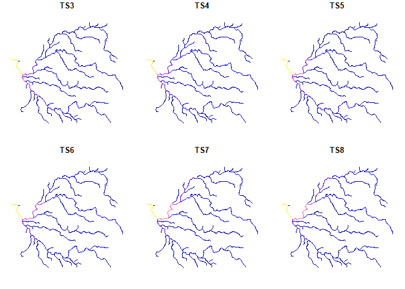

hydrostreamer
=============

[](https://doi.org/10.5281/zenodo.1214523)

**hydrostreamer** is an R package to downscale off-the-shelf runoff timeseries into explicitly represented river network. Downscaling is done by the spatial relationship between a polygon (raster cell) with runoff information and the river network. The cell value is divided among those river segments which intersect the cell in question using weights based on catchment area within the cell, or by river segment properties. Simple river routing algorithm is also provided to estimate discharge at each segment.

To install **hydrostreamer**, use *devtools::install\_github()* in RStudio. You should have R version higher than 3.4.0 for the package to work properly.

Basic usage
-----------

**hydrostreamer** workflow occurs in four steps, with a single wrapper function for each step:

1.  Convert the raster timeseries to a polygon grid
2.  Compute weights for each river segments
3.  Compute segment specific runoff
4.  Apply river routing

Minimum data requirement is a runoff timeseries, either as polygons or in raster format, and a river network as a 'clean', connected linestrings. In addition, using a polygon of an area of interest is strongly recommended.

First, load data to R:

``` r
library(sf)
library(raster)
library(hydrostreamer)

data(river)
data(basin)
runoff <- brick(system.file("extdata", "runoff.tif", package = "hydrostreamer"))
```

### 1. Convert raster timeseries to a polygon grid

If the runoff timeseries is in a raster format, it needs to be polygonized. *polygrid\_timeseries()* does that, and adds two columns: ID with unique ID for each polygon, and area\_m2, the surface area of each polygon. Providing an area of interest clips the polygons to the area.

``` r
grid <- polygrid_timeseries(runoff, aoi=basin)
```

### 2. Compute weights for each river segment

Next, we weight the river segments within each segment, so that the weights of segments within a polygon add to 1. In **hydrostreamer** this can be done by

1.  Catchment area of each river segment by
    1.  user provided catchments
    2.  drainage direction delineated basins (for river networks derived from them)
    3.  Medial axis delineated basins (Voronoi polygons for each river segment)
2.  River segment properties
    1.  divide runoff equally to all intersecting segments
    2.  use stream order to weight the segments
    3.  use segment length for weighting

Here, we use Voronoi delineated basins. For information on the other options, see *help(compute\_weights)*.

``` r
v.weights <- compute_weights(river, grid, "area", aoi=basin)
```


### 3. Compute segment specific runoff

With the weights computed, we can compute segment specific runoff.

``` r
v.runoff <- compute_segment_runoff(v.weights)
```

 
Plot first six timesteps:

``` r
plot(v.runoff[,5:10])
```



### 4. Apply river routing

The last step is to accumulate flow downstream. The previous step only assigned the grid cell value to the streams. This may be usable in itself, e.g. if we were interested whether the water use in a specific segment is self-sufficient, or is dependent on flow from upstream. However, often we want to know the accumulated discharge at certain points of the river.

**hydrostreamer** currently (April 2018) only implements the simplest possible river routing by adding all runoff to every segment downstream, at each timestep. This is an overly simple scheme, and there are plans to add more sophisticated river routing algorithms to the package.

``` r
v.flow <- accumulate_flow(v.runoff)
```

Plot the same timesteps as above:

``` r
plot(v.flow[,4:9])
```


Development
-----------

**hydrostreamer** provides simple tools to downscale off-the-shelf runoff products without performing additional modelling. The package is under rapid development. Some planned upcoming features in future releases include:

-   Support for 'Spatial' class objects in addition to 'sf'
-   More utility functions
-   General optimisation and parallelisation of the code
-   Add Muskingum river routing scheme. Possibly others as well
-   Investigate providing interface to high performance river routing applications, such as [RAPID](https://github.com/c-h-david/rapid/), or [mizuRoute](https://github.com/NCAR/mizuRoute).
-   Analysis and plotting functions supporting observation data
-   Optimising an ensemble of several runoff products based on observed flow

License
-------

The MIT License (MIT)

Copyright (c) 2018 Marko K. Kallio

Permission is hereby granted, free of charge, to any person obtaining a copy of this software and associated documentation files (the "Software"), to deal in the Software without restriction, including without limitation the rights to use, copy, modify, merge, publish, distribute, sublicense, and/or sell copies of the Software, and to permit persons to whom the Software is furnished to do so, subject to the following conditions:

The above copyright notice and this permission notice shall be included in all copies or substantial portions of the Software.

THE SOFTWARE IS PROVIDED "AS IS", WITHOUT WARRANTY OF ANY KIND, EXPRESS OR IMPLIED, INCLUDING BUT NOT LIMITED TO THE WARRANTIES OF MERCHANTABILITY, FITNESS FOR A PARTICULAR PURPOSE AND NONINFRINGEMENT. IN NO EVENT SHALL THE AUTHORS OR COPYRIGHT HOLDERS BE LIABLE FOR ANY CLAIM, DAMAGES OR OTHER LIABILITY, WHETHER IN AN ACTION OF CONTRACT, TORT OR OTHERWISE, ARISING FROM, OUT OF OR IN CONNECTION WITH THE SOFTWARE OR THE USE OR OTHER DEALINGS IN THE SOFTWARE.
